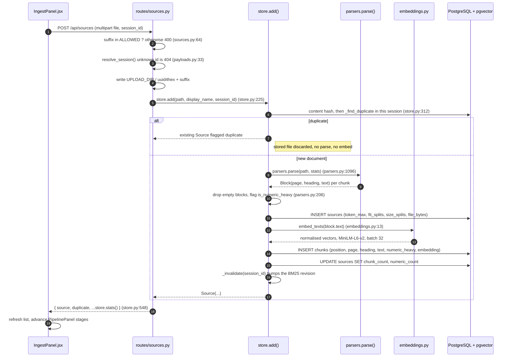
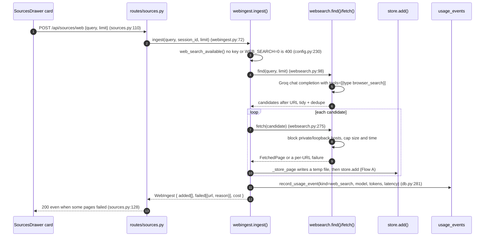
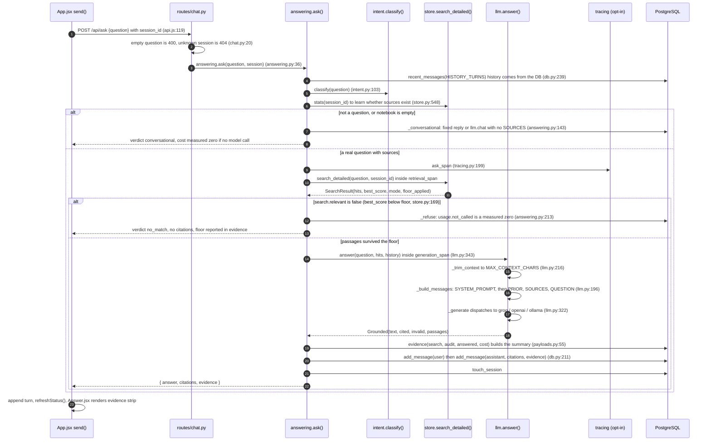
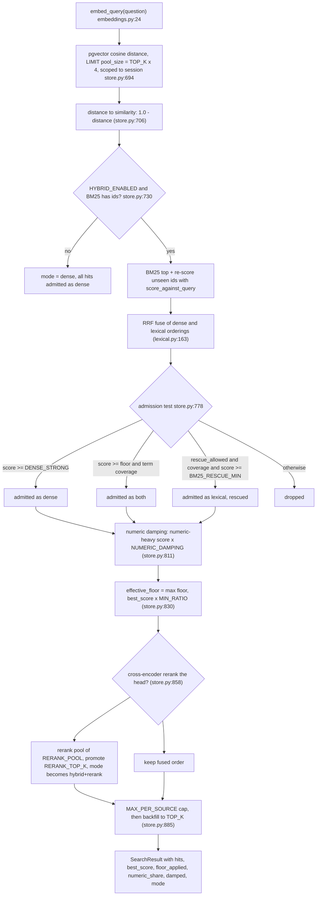

# Architecture: how the whole app fits together

Every flow in this document ends at a `module.py:line` reference so the picture can
be checked against the code rather than trusted. References were verified against
commit `d6ae9b8` on 2026-10-07; they drift as the code moves, and the line number
is the thing to re-check, not the shape.

Four things happen in this app: a document is uploaded and indexed, the web is
searched and indexed, a question is answered from what was indexed, and a
summary is written. Everything else — session CRUD, file viewing, the chunk map,
status — is a read over the same state.

---

## 1. The stack, end to end

```
┌────────────────────────────────  BROWSER  (frontend/src)  ────────────────────────────────┐
│ App.jsx ── turns[] ── send() (App.jsx:273) ──► api.ask()  (api.js:119)                    │
│   ├─ IngestPanel.jsx   drop → api.upload()  ───────────────┐                             │
│   ├─ SourcesDrawer.jsx source list, footer totals, panels  │                             │
│   ├─ Answer.jsx        answer + [n] citations + evidence   │                             │
│   ├─ PipelinePanel.jsx ingest diagram   ChunkMap.jsx        │                             │
│   └─ api.js  request() (api.js:19) → fetch, ?session_id= ◄──┘                            │
└───────────────────────────────────┬──────────────────────────────────────────────────────┘
                                    │  JSON over HTTP, no auth (local app)
                ════════════════════▼═════════════════════  FastAPI  app/main.py:37
                ║  routes/ — thin: parse → delegate → status code                          ║
                ║   chat.py      POST /ask, /summarize                                     ║
                ║   sources.py   POST /sources, /sources/web, GET …/file, …/chunks,        ║
                ║                …/reindex, DELETE, GET /occurrences                       ║
                ║   sessions.py  CRUD + messages/clear                                     ║
                ║   meta.py      GET /api/status (meta.py:22)                              ║
                ╚═══════════════════╤═════════════════════╝
        ┌───────────────────────────▼────────────────────────────  DOMAIN  ──┐
        │ answering.py   policy: classify → retrieve → floor → refuse/generate│
        │ store.py       hybrid retrieval + ingest + duplicate/reindex/cache  │
        │ llm.py         SYSTEM_PROMPT, provider dispatch, citation validation│
        │ parsers.py     pdf/docx/md/json/csv/code/log/html + OCR → blocks    │
        │ intent.py      greeting vs question vs empty-notebook               │
        │ payloads.py    evidence() summary, session payload                  │
        │ usage.py       Request/Usage, latency P50/P95, record()             │
        │ tracing.py     LangSmith spans (off by default)  │ webingest.py     │
        │ lexical.py BM25   embeddings.py MiniLM + reranker   websearch.py    │
        │ config.py env → constants   db.py SQL + alembic migrations          │
        └───────┬───────────────────────────────┬───────────────────┬─────────┘
                │                               │                   │
     ┌──────────▼──────────┐        ┌───────────▼────────┐   ┌──────▼──────────────┐
     │ PostgreSQL + pgvector│        │ UPLOAD_DIR files   │   │ EXTERNAL            │
     │ sessions, sources,   │        │ original uploads   │   │ Groq / OpenAI /     │
     │ chunks(+embedding),  │        │ (uuid-hex names)   │   │  Ollama (local)     │
     │ messages(evidence),  │        └────────────────────┘   │ HF model download   │
     │ usage_events,        │                                 │ Tesseract OCR       │
     │ ingest_reports       │                                 │ web fetch (SSRF-    │
     └──────────────────────┘                                 │  guarded)           │
                                                              │ LangSmith (opt-in)  │
                                                              └─────────────────────┘
```

Two properties the layout is built around:

- `routes/` handlers do no policy work. `app/answering.py:1` says so in its
  docstring, and reading any handler confirms it: parse, delegate, map one
  domain error to an HTTP status.
- The session is the isolation boundary. Retrieval, duplicate detection,
  lexical caches and every read of `chunks` are scoped by `session_id`.

---

## 2. Flow A — uploading a document



Parsing details worth knowing, because they are where an upload fails:

- `parsers.parse` dispatches by suffix: PDF (text layer first, Tesseract OCR for
  image-only pages, `parsers.py:609`), DOCX, Markdown, HTML, JSON/YAML/TOML,
  CSV/TSV tables, logs, Python and generic code, plain text.
- Two ceilings are applied while chunking: `CHUNK_SIZE = 900` characters
  (`config.py:109`) and `EMBED_MAX_TOKENS = 256` wordpieces counted with the
  embedding model's own tokenizer (`config.py:81`, `parsers.py:123`). A chunk
  that overflows the token limit is split, and the split is recorded as
  `fit_splits` on the source rather than silently truncated.
- `token_max` is the measured worst-case wordpiece count of any chunk — it is
  `0` only when the file was never token-walked, which is the NULL-vs-zero rule
  the rest of the app follows.

---

## 3. Flow B — "Search the web" and index the results



Partial success is the design: five results, three indexed, two refused is
returned as 200 with `failed` populated. 400 means nothing could run at all
(no key, disabled, empty query); 502 means the search itself failed upstream.

The web search is **manual** — it is never run as a side effect of a question.
That is why `usage_events` needs no link to a `messages` row.

---

## 4. Flow C — asking a question



### Inside `search_detailed` (`store.py:664`)



Why the floor sits *before* the reranker: the floor is the dense model's
calibrated decision and reranking after it only changes order, so paying for the
cross-encoder earlier would buy nothing. Why there are three admission rules
instead of one threshold: a strong term match with a mediocre dense score is
usually a real answer the embedding under-scored, and the eval corpus shows a
single global threshold cannot separate that case from noise.

---

## 5. The rest of the API

| Endpoint | Path through the code |
|---|---|
| `POST /api/summarize` | `chat.py:31` → `answering.summarize:252` → `store.search_detailed` → floor check → `llm.summarize:387` (SYSTEM_PROMPT + `TASK:`) → evidence written **without** `cost` → two rows |
| `GET /api/sources/{id}/chunks` | `sources.py:200` → `store.source_chunks:485`, session-scoped, ordered by `position`, adds `count_tokens` per chunk (`parsers.py:123`) → `ChunkMap` bar heights |
| `GET /api/sources/{id}/file` | `sources.py:154` → `store.original_file:467` (UPLOAD_DIR boundary) → `FileResponse`; scriptable content types forced to `text/plain` so uploaded HTML cannot run in the app's origin |
| `POST /api/sources/{id}/reindex` | `sources.py:231` → `store.reindex:333` re-parses the stored file with the current chunking, keeping the same source id |
| `GET /api/sources/occurrences?term=` | `sources.py:48` → `store.find_occurrences:588` → drawer highlight |
| `DELETE /api/sources/{id}` and `/api/sources` | `sources.py:279`, `sources.py:289` → `store.remove:424` / `store.clear:439`: rows, files, caches |
| `GET /api/status` | `meta.py:22` → `store.stats` + `db.usage_totals:309` + `tracing.status:77` + provider readiness |
| `/api/sessions` CRUD | `sessions.py` → `db.*`; `session_payload:96` attaches `recent_messages` for the transcript |

Error map, in one place: provider unreachable → `LLMUnavailable` → 503;
unknown session → 404; empty question or unsupported
file type → 400; a bug in retrieval or SQL → 500. The frontend turns any non-2xx
into an assistant-shaped error turn (`App.jsx:326`), so a failure is legible in
the thread instead of only in the console.

---

## 6. Where state lives

```
PostgreSQL (alembic, migrations/versions)
  0001 baseline      sessions, sources, chunks(embedding vector), messages
  0002 message_evidence   messages.evidence JSONB   (per-turn retrieval + cost)
  0003 source_url         sources.url
  0004 usage_events       kind, model, tokens, latency, session, created_at
  0005 ingest_observability  sources.token_max, fit_splits, avg_chars, max_chars
  0006 source_view        sources.file_bytes, size_splits  (nullable, unbackfilled)

UPLOAD_DIR        original files, named uuid4hex + suffix  (reindex needs no re-upload)

Caches            lru_cache SentenceTransformer (embeddings.py:9)
                  BM25 per (session, revision), rebuilt after _invalidate (store.py:207)

In process        usage.py latency window (P50/P95 over recent requests)
                  llm.py _last_usage, cleared before every call (llm.py:324)

Opt-in            LANGSMITH_TRACING spans → network, or JSONL when
                  LANGSMITH_TRACING_LOCAL=1 (tracing.py:77 reports the state)
```

Money and tokens: the database stores **tokens**, never dollars. Dollars are
computed at read time from a dated price table so the persisted fact cannot go
stale — see `README.md` "What a question costs" (line 1161) and
`PRESENTATION.md:743` for the current rationale, and the cost dashboard plan for
the rate table and its provenance.

---

## 7. Reading order, if you are new to this repo

1. `app/answering.py:1` — the whole policy in one readable function.
2. `app/store.py:664` — retrieval, with the reasoning for each step inline.
3. `app/llm.py:7` — `SYSTEM_PROMPT`, then `_build_messages` for what the model
   actually sees.
4. `app/parsers.py:1096` — how an arbitrary file becomes `Block`s.
5. `README.md` — the long-form narrative of the same flows, plus the eval
   numbers behind the chunking and retrieval choices.
6. `PRESENTATION.md` — shorter, decision-oriented version of the above.
